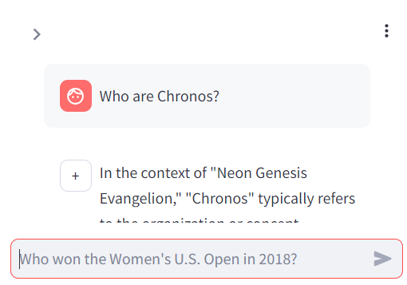
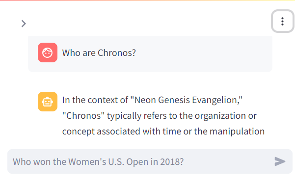

# 🎈 My Note


## From previous commit

With this code 
```
with st.chat_message("+"):
   cfg = RunnableConfig()
   cfg["configurable"] = {"session_id": "any"}
   response = executor_with_memory.invoke({"input": prompt}, cfg)
   st.write(response["output"])
```
ข้อความที่เด้งมาหลังจากสั่ง invoke agent จะ มี avartar เป็น +


อย่างไรก็ตาม เข้าใจว่า ข้อความของ response สุดท้าย ถูกบันทึกเข้าไปใน msgs แล้ว เพราะ่ว่า ถ้าเกิดการ rerun ใหม่ โดยที่ข้อความใหม่จาก user ยังไม่ได้ถูกป้อนเข้าไป ข้อความล่าสุดดังกล่าวกลับโชว์ขึ้นมาภายใต้ avartar ใหม่ ความเป็นไปได้เดียวก็คือมันน่าจะ ถูก print โดย block นี้

```
for idx, msg in enumerate(msgs.messages):
    with st.chat_message(msg.type):
        st.write(msg.content)
```



## Update
This chunk has been modified to confirm that, after our agent invokes, the lastest content of the response has been recorded in `msgs.messages`
```
    cfg = RunnableConfig()
    cfg["configurable"] = {"session_id": "any"}
    response = executor_with_memory.invoke({"input": prompt}, cfg)
    
    msg = msgs.messages[-1]
    latest_slot = st.chat_message("-")
    latest_slot.write(msg.content)
```

